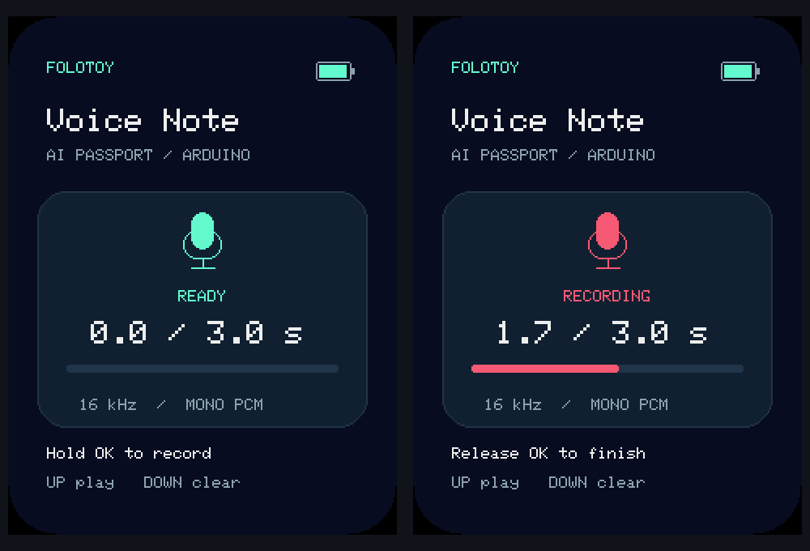

# Push-to-talk voice note

[简体中文](recording.zh_CN.md)

Open [PushToTalk](../examples/PushToTalk/PushToTalk.ino) in Arduino IDE.
The example records signed 16-bit, 16 kHz mono PCM into a 96 KB RAM buffer.
It needs no PSRAM, network, filesystem, or API key. Notes disappear on reset.

- Hold OK: start recording immediately after button debounce; the screen shows
  RECORDING, elapsed audio duration, and an input-level bar.
- Release OK: finish the note. Holding longer stops automatically at three seconds;
  release and press again to make another note.
- UP: play the saved note through the onboard speaker.
- DOWN: clear a saved note, or stop playback. Clearing requires another DOWN press
  after cancelling playback.

The microphone gain starts at 24 dB with clipping reported in the serial log; playback volume is 85%.
Adjust these in the sketch for the recording distance. The serial monitor at
115200 baud reports samples, duration, wall time, peak, RMS, and clipped samples.
A partial I/O transfer is an error, not a passing recording. The UI uses English
labels with Adafruit's built-in font; no additional font assets are required.

The screen follows the main firmware's 30 px black corner mask, with a battery
indicator, rounded content card, recording state, and contextual controls.
Gauge failure displays `--` and does not block recording. Battery polling pauses
while audio is recording/playing. Only the small progress region redraws during
audio; the sketch polls buttons between 10 ms PCM chunks.

Layout preview generated from the sketch geometry and built-in font; not a device photograph. The displayed 99% is illustrative.

## Device acceptance

Record ordinary speech for approximately three seconds, release OK, then press UP.
Confirm recognizable speech without obvious noise, clipping, or interruptions.
Repeat with a short press, a hold exceeding three seconds, a second recording,
playback cancellation, and clearing. Compare captured duration with wall time;
check for clipped samples and capture failures. A successful build, non-zero
microphone samples, or an audible test tone does not establish speech quality.

See [validation](validation.md) for completed checks; this example's physical
record/replay acceptance must be recorded separately.
